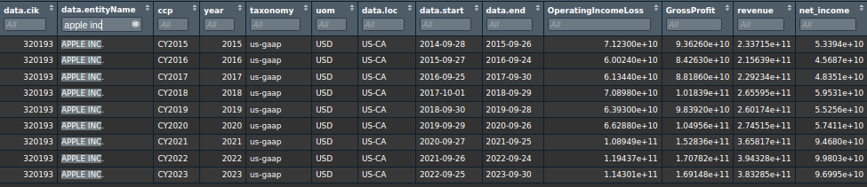
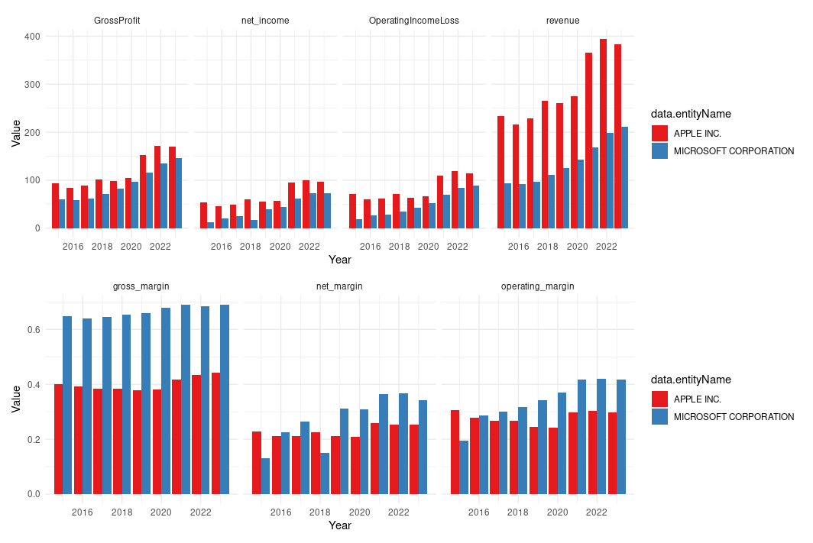

# tidyedgar: Streamlined Access to EDGAR's Financial Data

tidyedgar is an R package designed to simplify acquiring and transforming fundamental financial data from the EDGAR database. Leveraging the official S.E.C. API, TidyEDGAR outputs data in a clean, 'tidy' format ideal for financial analysis and stock screening based on fundamental data.

## Features

-   Ease of Use: Automates the retrieval and preprocessing of financial data.
-   Tidy Format: Structures data in a convenient format for analysis.
-   Comprehensive Coverage: Access data across all U.S. public companies.
-   Versatile Analysis: Suitable for fundamental analysis and stock screening.

## Installation

Install TidyEDGAR using:

```         
install.packages("tidyedgar")
```

Or to get the development version:

```         
devtools::install_github("gerardgimenezadsuar/tidyedgar")
```

## Usage

### Call the following function to get a comprehensive fundamental analysis dataframe:

```         
df <- yearly_data(years = 2015:2023)
```

This will get you the following financials for ALL companies in EDGAR:



And easily you can create plots like this:



The previous example showcased the main wrapper function. However, there are many options to customize the data retrieval and processing.

Fetching the latest (2020-2023) yearly financial data, of certain account names:

```         
net_income <- get_ydata(account = "NetIncomeLoss")
revenue <- get_ydata(account = "Revenues")
op_income <- get_ydata(account = "OperatingIncomeLoss")
```

Transforming and analyze the data with additional metrics such as net margin and year-over-year changes:

```         
yearly <- prepare_data(revenue, net_income, op_income, quarterly = F)
```

Do you need quarterly data? You can use:

```         
get_qdata()
```

In combination with:

```         
prepare_data(df, quarterly = TRUE)
```

For suggestions/bug reporting, feel free to reach out at gerard\@solucionsdedades.cat
