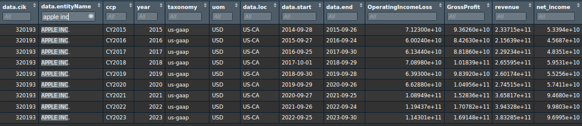
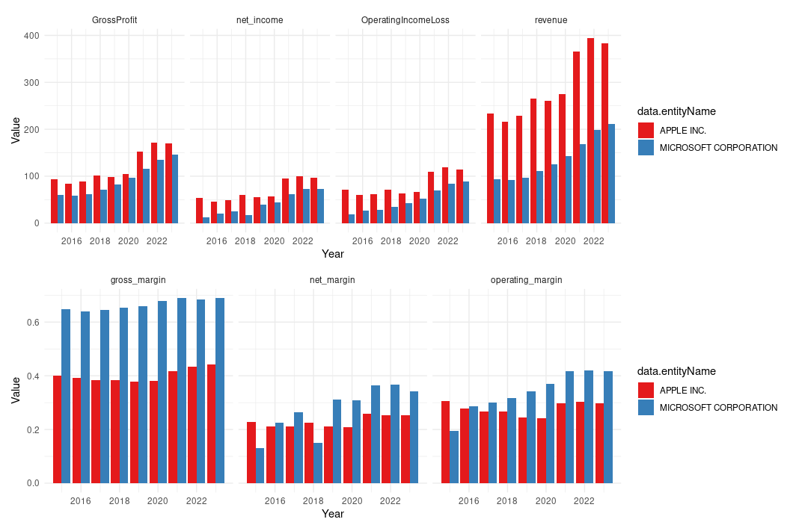

# tidyedgar: Bulk Fundamental Financial Data from EDGAR


**tidyedgar** is an R package for **bulk analysis** of fundamental financial data from the SEC's EDGAR database. Unlike other packages that retrieve data one company at a time, tidyedgar specializes in getting financial data for **ALL U.S. public companies at once**, making it ideal for market-wide screening, quantitative research, and comparative analysis.

Leveraging the official S.E.C. API, tidyedgar outputs data in a clean, 'tidy' format ready for analysis.

## Key Features

-   **Bulk-First Design**: Retrieve data for thousands of companies in a single function call
-   **Complete Financial Statements**: Get full income statements, balance sheets, and cash flow statements
-   **Built-in Screening**: Filter across all companies by revenue, margins, growth rates, and more
-   **Pre-calculated Ratios**: Automatic calculation of ROA, ROE, debt ratios, and other key metrics
-   **Tidy Format**: Analysis-ready dataframes with consistent structure
-   **Time-Series Ready**: Easy year-over-year and quarter-over-quarter comparisons

## Installation

Install tidyedgar from CRAN:

```r
install.packages("tidyedgar")
```

Or get the development version with new bulk functions:

```r
devtools::install_github("gerardgimenezadsuar/tidyedgar")
```

## Quick Start: Bulk Financial Analysis

### Get Complete Financial Statements (All Companies)

```r
library(tidyedgar)

# Income statement for ALL companies
income <- get_income_statement(years = 2020:2023)

# Balance sheet for ALL companies
balance <- get_balance_sheet(years = 2020:2023)

# Cash flow statement for ALL companies
cashflow <- get_cash_flow_statement(years = 2020:2023)
```

### Screen Companies Market-Wide

Find profitable companies with revenue > $1B and net margins > 15%:

```r
top_companies <- screen_companies(
  years = 2022:2023,
  revenue_min = 1e9,              # $1 billion minimum
  net_margin_min = 0.15,          # 15% margin minimum
  profitable_only = TRUE,
  return_latest = TRUE
)

# Result: All companies meeting these criteria across the entire market
head(top_companies)
```

### Calculate Financial Ratios in Bulk

```r
# Get ROA, ROE, and liquidity ratios for ALL companies
ratios <- get_financial_ratios(
  years = 2020:2023,
  ratios = c("roa", "roe", "current_ratio", "debt_to_equity")
)

# Find companies with high ROE and low debt
strong_performers <- ratios %>%
  filter(ROE > 0.20, debt_to_equity < 1.0)
```

## Common Use Cases

### 1. Market-Wide Screening

Find fast-growing tech companies:

```r
growth_companies <- screen_companies(
  years = 2020:2023,
  revenue_min = 5e8,              # $500M+ revenue
  revenue_growth_min = 0.25,      # 25%+ annual growth
  operating_margin_min = 0.10     # 10%+ operating margin
)
```

### 2. Sector Comparison

Compare a company to all others:

```r
# Get all companies' income statements
all_income <- get_income_statement(years = 2023)

# Calculate percentile rankings
all_income %>%
  filter(revenue > 1e9) %>%
  mutate(
    margin_percentile = percent_rank(net_margin),
    revenue_percentile = percent_rank(revenue)
  ) %>%
  arrange(desc(net_margin))
```

### 3. Time-Series Analysis

Analyze trends across the market:

```r
# Get 10 years of data for all companies
historical <- yearly_data(years = 2014:2023)

# Find companies with consistent growth
consistent_growers <- historical %>%
  group_by(data.cik, data.entityName) %>%
  filter(n() >= 5) %>%  # At least 5 years of data
  summarize(
    avg_revenue_growth = mean(change_R, na.rm = TRUE),
    revenue_volatility = sd(change_R, na.rm = TRUE),
    avg_margin = mean(net_margin, na.rm = TRUE)
  ) %>%
  filter(avg_revenue_growth > 0.15, revenue_volatility < 0.20)
```

### 4. Build Custom Datasets

For the most flexibility, combine individual accounts:

```r
# Get specific accounts for custom analysis
revenue <- get_ydata(account = "Revenues", years = 2020:2023)
net_income <- get_ydata(account = "NetIncomeLoss", years = 2020:2023)
rd_expense <- get_ydata(account = "ResearchAndDevelopmentExpense", years = 2020:2023)

# Combine and calculate custom metrics
custom_data <- prepare_data(revenue, net_income, rd_expense, quarterly = FALSE) %>%
  mutate(rd_intensity = ResearchAndDevelopmentExpense / revenue)
```

## Function Hierarchy

### High-Level (One-Line Bulk Operations)

-   `yearly_data()`: Get key metrics for all companies (revenue, margins, growth)
-   `get_income_statement()`: Complete income statement, all companies
-   `get_balance_sheet()`: Complete balance sheet, all companies
-   `get_cash_flow_statement()`: Complete cash flow statement, all companies
-   `screen_companies()`: Filter companies by financial criteria
-   `get_financial_ratios()`: Calculate ratios in bulk

### Mid-Level (Customizable Queries)

-   `get_ydata()`: Get specific accounts (yearly) for all companies
-   `get_qdata()`: Get specific accounts (quarterly) for all companies
-   `prepare_data()`: Combine and transform financial data

### Low-Level (Advanced)

-   `retrieve_data()`: Direct API access to specific account/year/quarter

## Quarterly Data

All bulk functions support quarterly data:

```r
# Quarterly income statements
q_income <- get_income_statement(
  years = 2023,
  quarterly = TRUE,
  quarters = c("Q1", "Q2", "Q3", "Q4")
)

# Quarterly screening
q_screen <- screen_companies(
  years = 2023,
  revenue_min = 1e9,
  return_latest = TRUE
)
```

## Example: Finding Investment Opportunities

```r
# Find undervalued companies with strong fundamentals
candidates <- get_financial_ratios(
  years = 2022:2023,
  ratios = c("roa", "roe", "current_ratio", "debt_to_equity")
) %>%
  filter(
    ROE > 0.15,              # Strong profitability
    current_ratio > 1.5,     # Good liquidity
    debt_to_equity < 0.5     # Conservative debt
  ) %>%
  arrange(desc(ROE))

# Get detailed financials for these companies
detailed <- get_income_statement(years = 2020:2023) %>%
  filter(data.cik %in% candidates$data.cik)
```

## Visualizations

This will get you comprehensive financials for ALL companies in EDGAR:



And easily create comparative plots:



## Performance Tips

-   Start with recent years (2020-2023) for faster initial analysis
-   Use `return_latest = TRUE` in `screen_companies()` to reduce data size
-   Request specific ratios instead of "all" to minimize API calls
-   Consider quarterly vs yearly data based on your needs (yearly is faster)

## Why tidyedgar for Bulk Analysis?

| Feature | tidyedgar | Traditional Approaches |
|---------|-----------|----------------------|
| Get 1000 companies | 1 function call | 1000 API calls |
| Market screening | Built-in | Manual filtering |
| Financial statements | Pre-organized | Manual assembly |
| Ratios | Auto-calculated | Manual formulas |
| Format | Tidy/analysis-ready | Requires cleaning |

## Contact

For suggestions/bug reporting, reach out at gerard@solucionsdedades.cat
